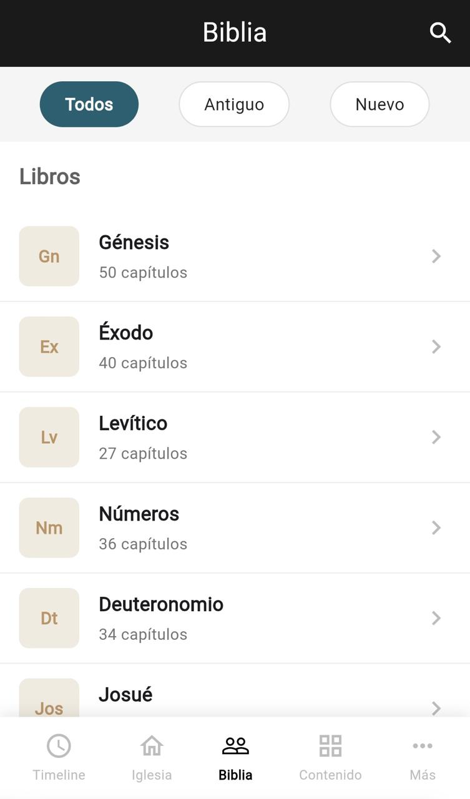

# 📱 Iglesia - App Móvil

Aplicación móvil multiplataforma desarrollada en Flutter para Iglesia cristiana, diseñada para mantener conectada a la comunidad con contenido espiritual, eventos, y recursos de la iglesia.

---

## 📸 Capturas de Pantalla

### Timeline

*Vista de las publicaciones más recientes a las más antiguas*

### Iglesia

*Sección informativa de la Iglesia (Misión, Visión, entre otros)*

### Biblia

*Visualización completa de la biblia, con filtros para el nuevo y antiguo testamento.*

### Contenido

*Visualización de videos, playlist, entre otros.*

---

## 📋 Tabla de Contenidos

- [Características](#-características)
- [Tecnologías](#-tecnologías)
- [Requisitos Previos](#-requisitos-previos)
- [Instalación](#-instalación)
- [Estructura del Proyecto](#-estructura-del-proyecto)
- [Configuración de Firebase](#-configuración-de-firebase)
- [Funcionalidades Implementadas](#-funcionalidades-implementadas)
- [Despliegue](#-despliegue)
- [Roadmap](#-roadmap)
- [Contribuir](#-contribuir)
- [Licencia](#-licencia)

---

## ✨ Características

- 📰 **Timeline** - Feed de publicaciones con eventos y anuncios
- ⛪ **Información de la Iglesia** - Sobre nosotros, equipo, horarios
- 📖 **Biblia Completa** - 66 libros con búsqueda y lectura
- 🎬 **Contenido Multimedia** - Videos, playlist, fotos y más
- 📱 **Diseño Responsive** - Funciona en iOS, Android y Web
- 🔥 **Tiempo Real** - Actualizaciones instantáneas con Firebase
- 🎨 **UI Moderna** - Diseño limpio e intuitivo

---

## 🛠 Tecnologías

### **Frontend**
- Flutter 3.x
- Dart 3.x

### **Backend & Database**
- Firebase Firestore
- Firebase Storage
- Firebase Hosting (Web)

### **Librerías Principales**
```yaml
dependencies:
  firebase_core: ^3.6.0
  cloud_firestore: ^5.4.4
  firebase_storage: ^12.3.4
  share_plus: ^10.0.2
  url_launcher: ^6.2.5
  cached_network_image: ^3.4.1
  intl: ^0.19.0
  http: ^1.2.0
```

---

## 📦 Requisitos Previos

- Flutter SDK (3.0.0 o superior)
- Dart SDK (3.0.0 o superior)
- Android Studio / Xcode (para desarrollo móvil)
- Node.js y npm (para Firebase CLI)
- Cuenta de Firebase

---

## 🚀 Instalación

### 1. Clonar el repositorio
```bash
git clone https://github.com/GAMR11/app-church.git
cd app-cruch
```

### 2. Instalar dependencias
```bash
flutter pub get
```

### 3. Configurar Firebase
```bash
# Instalar Firebase CLI
npm install -g firebase-tools

# Iniciar sesión
firebase login

# Instalar FlutterFire CLI
dart pub global activate flutterfire_cli

# Configurar Firebase en el proyecto
flutterfire configure
```

### 4. Ejecutar la aplicación
```bash
# Desarrollo
flutter run

# Para dispositivo específico
flutter run -d <device-id>

# Web
flutter run -d chrome
```

---

## 📁 Estructura del Proyecto
```
lib/
├── main.dart                      # Punto de entrada
├── models/                        # Modelos de datos
│   ├── post_model.dart           # Posts del timeline
│   ├── church_info_model.dart    # Información de la iglesia
│   ├── team_member_model.dart    # Miembros del equipo
│   ├── bible_model.dart          # Estructura de la Biblia
│   ├── video_model.dart          # Videos y playlist
│   └── album_model.dart          # Álbumes de fotos
├── screens/                       # Pantallas principales
│   ├── timeline_screen.dart      # Feed principal
│   ├── iglesia_screen.dart       # Info de la iglesia
│   ├── post_detail_screen.dart   # Detalle de evento
│   ├── team_member_detail_screen.dart
│   ├── biblia_screen.dart        # Lista de libros
│   ├── biblia_chapter_screen.dart # Selección de capítulos
│   ├── biblia_reading_screen.dart # Lectura de la Biblia
│   ├── album_detail_screen.dart  # Galería de fotos
│   ├── contenido_screen.dart     # Hub de contenido
│   └── mas_screen.dart           # Más opciones
├── widgets/                       # Widgets reutilizables
│   ├── post_card.dart            # Tarjeta de post
│   ├── bottom_nav_bar.dart       # Navegación inferior
│   ├── sobre_tab.dart            # Tab "Sobre" de iglesia
│   ├── equipo_tab.dart           # Tab de equipo
│   ├── videos_tab.dart           # Grid de videos
│   ├── playlist_tab.dart         # Grid de playlist
│   └── fotos_tab.dart            # Grid de álbumes
└── services/                      # Servicios de datos
    ├── firebase_service.dart     # Posts y eventos
    ├── church_service.dart       # Info de iglesia
    ├── team_service.dart         # Equipo ministerial
    ├── bible_service.dart        # API de Biblia
    ├── content_service.dart      # Videos y multimedia
    └── album_service.dart        # Álbumes de fotos
```

---

## 🔥 Configuración de Firebase

### Colecciones de Firestore

#### **1. `posts` - Publicaciones del Timeline**
```json
{
  "tipo": "evento",
  "titulo": "Hijos de Luz",
  "subtitulo": "Por Marco Rebaño",
  "descripcion": "Reunión dominical especial",
  "detalleCompleto": "Texto completo del evento...",
  "imagenUrl": "https://...",
  "fechaPublicacion": "timestamp",
  "fechaEvento": "timestamp",
  "autor": "iglesia",
  "horarios": ["11:30 - 14:00", "18:30 - 21:00"],
  "ubicaciones": ["AUDITORIO 10:30 AM"],
  "costo": "Gratis",
  "hashtags": ["HijosDeluz", "IglesiaCasa"],
  "enlaceWeb": "http://www.iglesia",
  "permitirCompartir": true
}
```

#### **2. `church_info` - Información de la Iglesia**
```json
{
  "nombre": "iglesia",
  "descripcion": "Comunidad transmisional...",
  "slogan": "Estamos en muchas casas...",
  "telefono": "(55) 8570-0943",
  "email": "carmen@iglesia",
  "sitioWeb": "https://www.iglesia",
  "imagenesCarrusel": ["url1", "url2", "..."],
  "redesSociales": {...},
  "horarios": [...],
  "quienesSomos": "...",
  "mision": {...},
  "vision": {...},
  "valores": [...],
  "ubicaciones": [...],
  "declaracionFe": [...]
}
```

#### **3. `equipo` - Miembros del Equipo**
```json
{
  "nombre": "Delfina Peralta",
  "rol": "Presbíteros",
  "cargo": "Maestros IC CDMX",
  "imagenUrl": "https://...",
  "descripcion": "Biografía completa...",
  "orden": 1,
  "activo": true,
  "fechaOrdenacion": "07.01.24"
}
```

#### **4. `contenido` - Videos y Playlist**
```json
{
  "titulo": "¿Aceptas el reto?",
  "descripcion": "Mensaje poderoso...",
  "thumbnailUrl": "https://img.youtube.com/vi/.../maxresdefault.jpg",
  "videoUrl": "https://www.youtube.com/watch?v=...",
  "categoria": "videos",
  "fechaPublicacion": "timestamp",
  "autor": "Gonzalo Montes",
  "duracion": 2400,
  "visualizaciones": 0,
  "activo": true
}
```

#### **5. `albums` - Álbumes de Fotos**
```json
{
  "titulo": "Jesus en las calles",
  "descripcion": "Evento de evangelismo...",
  "ubicacion": "Riobamba",
  "fechaPublicacion": "timestamp",
  "activo": true,
  "totalFotos": 18,
  "fotos": ["url1", "url2", "..."]
}
```

### Reglas de Seguridad
```javascript
rules_version = '2';
service cloud.firestore {
  match /databases/{database}/documents {
    match /posts/{postId} {
      allow read: if true;
      allow write: if true;
    }
    
    match /church_info/{document=**} {
      allow read: if true;
      allow write: if true;
    }
    
    match /equipo/{memberId} {
      allow read: if true;
      allow write: if true;
    }
    
    match /contenido/{contentId} {
      allow read: if true;
      allow write: if request.auth != null;
    }
    
    match /albums/{albumId} {
      allow read: if true;
      allow write: if request.auth != null;
    }
  }
}
```

### Índices Necesarios

Crea estos índices compuestos en Firestore:

1. **Colección `equipo`:**
   - `activo` (Ascendente) + `orden` (Ascendente)

2. **Colección `contenido`:**
   - `categoria` (Ascendente) + `activo` (Ascendente) + `fechaPublicacion` (Descendente)

---

## 🎯 Funcionalidades Implementadas

### ✅ **1. Timeline (Feed Principal)**
- Feed de publicaciones con eventos y anuncios
- Tarjetas con imágenes, títulos y descripciones
- Filtrado por tipo (evento, video, anuncio)
- Pull-to-refresh
- Navegación a detalle de evento

### ✅ **2. Detalle de Evento**
- AppBar con imagen expandible (parallax)
- Badge de tipo de evento
- Fecha destacada
- Descripción completa con formato
- Horarios con íconos
- Ubicaciones con gradiente
- Hashtags en chips
- Botón para compartir (copia al portapapeles en web, menú nativo en móvil)

### ✅ **3. Iglesia**

**Tab "Sobre":**
- Carousel automático con 9 imágenes
- Nombre y slogan de la iglesia
- Descripción con formato
- Información de contacto (web, email, teléfonos)
- Íconos de redes sociales (7 plataformas)
- Horarios de servicio por día
- Quiénes somos
- Misión con versículos bíblicos
- Visión con versículos bíblicos
- Valores en lista
- Ubicaciones de sedes
- Declaración de fe completa

**Tab "Equipo":**
- Lista agrupada por roles (Presbíteros, Pastores, etc.)
- Foto, nombre y cargo de cada miembro
- Navegación a perfil detallado
- Biografía completa
- Fecha de ordenación
- Información de contacto

### ✅ **4. Biblia Completa**
- 66 libros (Antiguo y Nuevo Testamento)
- Filtro por testamento
- Navegación por libro → capítulos → versículos
- Dropdowns para cambiar libro/capítulo
- Versículos numerados
- Formato de lectura limpio
- Integración con API (scripture.api.bible)
- Fallback con datos locales

### ✅ **5. Contenido Multimedia**

**Tab "Videos":**
- Grid 2x2 con thumbnails
- Play icon overlay
- Duración del video
- Título y autor
- Clic abre YouTube/plataforma externa
- Contador de visualizaciones

**Tab "Playlist":**
- Grid 2x2 con música/videos musicales
- Badge "PLAYLIST"
- Icono de nota musical
- Thumbnails de YouTube
- Título y artista
- Abre YouTube/plataforma externa

**Tab "Fotos":**
- Grid de álbumes
- Portada con contador de fotos
- Ubicación del evento
- Galería interna en grid 3x3
- Fullscreen con zoom
- Deslizar entre fotos
- Contador "1 / 18"

### ✅ **6. Navegación**
- Bottom Navigation Bar con 5 secciones
- Timeline, Iglesia, Biblia, Contenido, Más
- Transiciones suaves
- Mantiene estado al cambiar tabs

### ✅ **7. Características Técnicas**
- Diseño responsive (móvil y web)
- Datos en tiempo real con Firebase Streams
- Manejo de CORS para imágenes en web
- Lazy loading de imágenes
- Caché de imágenes
- Hot reload para desarrollo rápido
- Manejo de errores con fallbacks

---

## 🌐 Despliegue

### **Web (Netlify)**
```bash
# Compilar para web
flutter build web --release

# El build estará en: build/web/

# Desplegar en Netlify
# 1. Arrastra la carpeta build/web a netlify.com/drop
# 2. O conecta con GitHub para deploy automático
```

**Archivo `netlify.toml`:**
```toml
[build]
  publish = "build/web"

[[redirects]]
  from = "/*"
  to = "/index.html"
  status = 200
```

### **Android (APK)**
```bash
# APK de release
flutter build apk --release

# APK optimizado por arquitectura
flutter build apk --split-per-abi --release

# El APK estará en: build/app/outputs/flutter-apk/
```

### **iOS (App Store)**
```bash
# Build para iOS (requiere Mac y Xcode)
flutter build ios --release

# Abrir en Xcode para subir a App Store
open ios/Runner.xcworkspace
```

---

## 🗺 Roadmap

### **Próximas Funcionalidades:**
- [ ] Tab "Biblioteca" (recursos descargables)
- [ ] Tab "Devocionales" (contenido diario)
- [ ] Tab "Artículos" (blog de la iglesia)
- [ ] Tab "Noticias" (comunicados)
- [ ] Sección "Más" (configuraciones y perfil)

### **Futuras Mejoras:**
- [ ] Autenticación de usuarios
- [ ] Notificaciones push
- [ ] Modo offline
- [ ] Donaciones en línea

---


## 📄 Licencia

Este proyecto está bajo la Licencia MIT. Ver archivo `LICENSE` para más detalles.

---

## 👥 Equipo

**Desarrollado por:** Gustavo Morales  
**Cliente:** Iglesia  
**Año:** 2025

---

## 📞 Contacto

- **Web:** https://db-church.web.app/
- **Email:** gamr130898@gmail.com

---

## 🙏 Agradecimientos

- Firebase por la infraestructura backend
- Flutter team por el framework
- scripture.api.bible por la API de la Biblia
- Comunidad de iglesia

---

## 📊 Estadísticas del Proyecto

- **Líneas de código:** ~8,000+
- **Archivos Dart:** 30+
- **Colecciones Firestore:** 5
- **Pantallas:** 15+
- **Widgets personalizados:** 20+

---

## 🐛 Problemas Conocidos

- En Flutter Web, algunas imágenes externas pueden requerir proxy CORS
- La API de la Biblia requiere conexión a internet
- Recomendado probar en dispositivo físico para mejor rendimiento

---

## 💡 Tips de Desarrollo

### Hot Reload
```bash
r  # Hot reload (recarga rápida)
R  # Hot restart (reinicio completo)
q  # Salir
```

### Limpiar proyecto
```bash
flutter clean
flutter pub get
```

### Ver dispositivos disponibles
```bash
flutter devices
```

---

**⭐ Si este proyecto te fue útil, considera darle una estrella en GitHub**